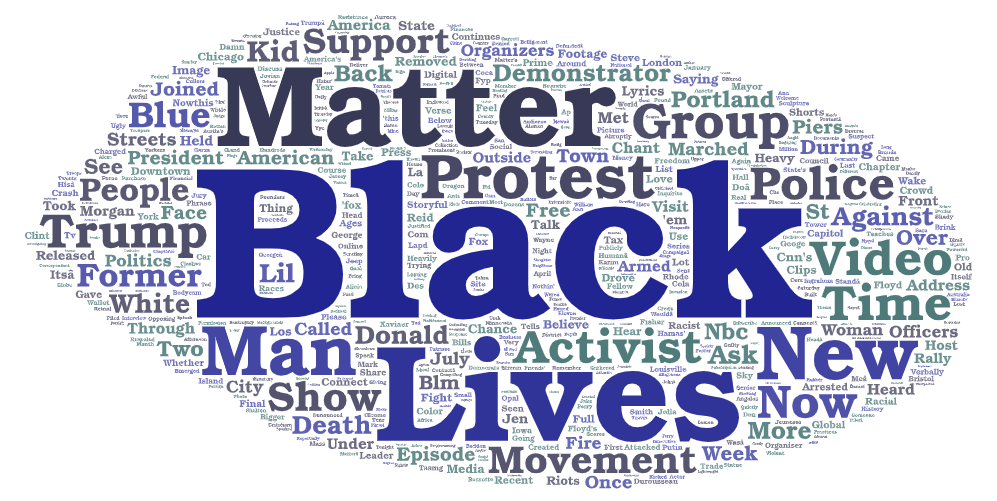
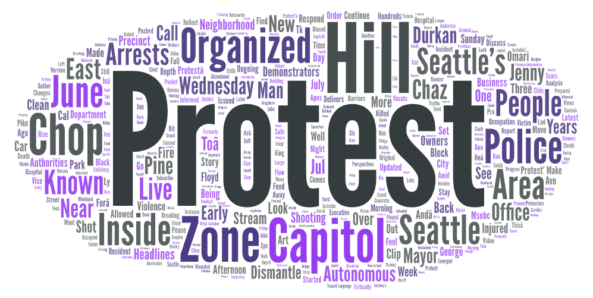
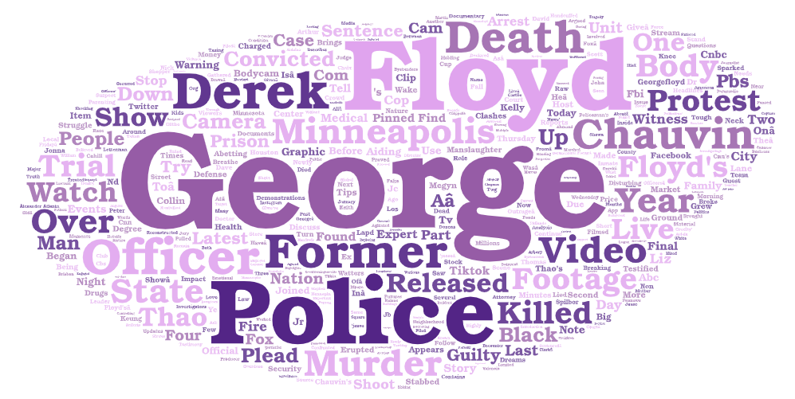

# Camille Zahn
# Lab 02, GEOG 458

## Topic
I was curious to see what the youtube results would show when I searched for things relating to the Black Lives Matter Movement. I decided to set my search parameters as 'BLM', 'Capitol Hill Organized Protest', and 'George Floyd'. As it is now three years past George Floyd's murder and the subsequent CHOP zone in Seattle, I wanted to compare the common words in headlines pertaining to BLM by not only using BLM as a search term for a more general reflection of the movement, but also including specific examples of events to see how search results differ. 

## Comparison
Although each search query was on the same general topic, the three resulting word clouds differed significantly. There were a few common words among the clouds, such as 'protest', 'police', and 'death', but each cloud was incredibly original and the larger words were very specific to the particular search term. For example, the largest words by far in the George Floyd cloud are, of course, 'George' and 'Floyd'. The differences in the clouds are likely due to the fact that George Floyd and Capitol Hill Organized Protest are specific events of the BLM movement that had numerous videos focusing on just those events, causing the descriptions to vary greatly between each search query. 

## Future Improvement 
I noticed that this web scraper only recorded about 80 instances. While this was enough to create a successful word cloud, more data is always better and I believe a better understanding of whatever is being searched for could be drawn from more data. Additionally, this web scraper only scrapes YouTube for data, and it is possible that there would be better results from scraping Google or another search engine. 

## Notable Takeaways
I noticed that in each word cloud the search terms themselves were by far the largest words, and most other words are quite small. This leads to conclusions regarding YouTube's search algorithm - it was looking for results that include the search terms themselves, rather than a more advanced search that also involves related videos that may not include exactly the search terms in the short description.

[BLM spreadsheet](assets/videos.BLM.csv)

[CHOP spreadsheet](assets/videos.CHOP.csv)

[George Floyd spreadsheet](assets/videos.GeorgeFloyd.csv)
